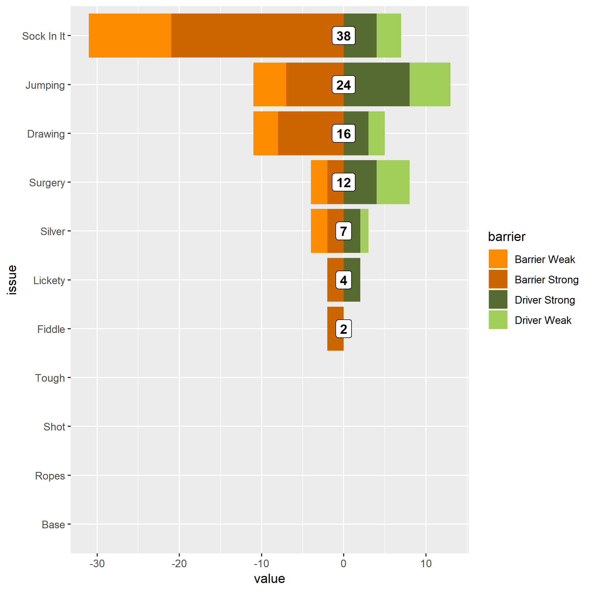

<!-- README.md is generated from README.Rmd. Please edit that file -->

```{r setup, include = FALSE}
knitr::opts_chunk$set(
  collapse = TRUE,
  comment = "#>"
)
```


## Diverging Graph Example





```r 
data3 %>% 
  ggplot(aes(x= reorder(issue, (rank)), y = value, fill = barrier)) +
  geom_col() + 
  scale_fill_manual(values = c("darkorange3", "darkorange", "darkolivegreen", "darkolivegreen3")) +
  coord_flip()
```

See [make_graph2.Rmd](make_graph2.Rmd) or make_graph2.nb.html
