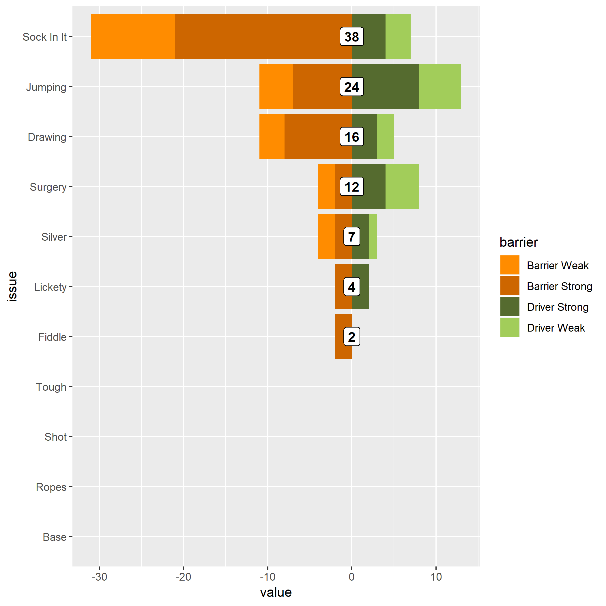

<!-- README.md is generated from README.Rmd. Please edit that file -->
Diverging Graph Example
-----------------------



``` r
data3 %>% 
  ggplot(aes(x= reorder(issue, (rank)), y = value, fill = barrier)) +
  geom_col() + 
  scale_fill_manual(values = c("darkorange3", "darkorange", "darkolivegreen", "darkolivegreen3")) +
  # scale_fill_brewer(type = "div", palette = "PuOr") +
  coord_flip()
```

See [make\_graph2.Rmd](make_graph2.Rmd) or make\_graph2.nb.html
